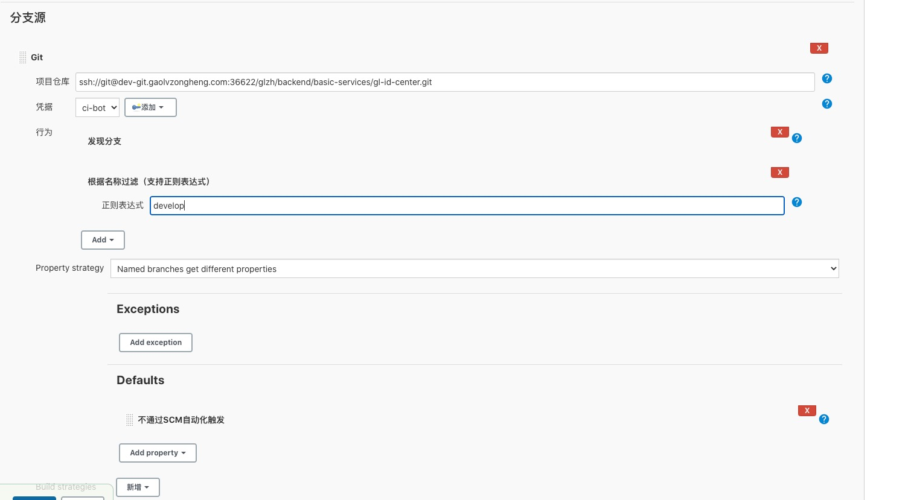
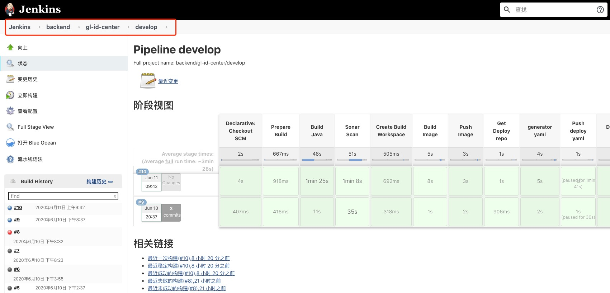

# Jenkins 发布流程

## Jenkins 目录规范

Jenkins 新建任务选择文件夹，创建对应文件夹对应 gitlab organization, 对应关系如下:

```bash
android  文件夹 --> gitlab android  组
backend  文件夹 --> gitlab backend  组
frontend 文件夹 --> gitlab frontend 组
ios      文件夹 --> gitlab ios      组
ops      文件夹 --> gitlab ops      组
```

## Jenkins Jobs 规范

Jenkins jobs 在 Jenkins 所对应的目录下，对应 gitlab 的 project, 对应关系如下:

```bash
# 目录/Job，Job 名称和 gitlab 的 project 对应
jenkins ops/ansible  --> gitlab glzh/ops/ansible
# 如果多级的话只对应二级组
jenkins backend/gl-id-center --> gitlab  glzh/backend/basic-services/gl-id-center
```

## Jenkins 创建流水线规范

Jenkins 流水线类型，选择 `多分支流水线` , 触发通过 Jenkinsfile, 添加完成之后记得在分支源里 Default 字段，选择不通过 SCM 自动触发。




## 自动化发布流程

```
+-------+     +---------------+     +-------------------------+
| Build | --> | Sonar Scanner | --> |   Build Docker Image    |
+-------+     +---------------+     +-------------------------+
                                      |
                                      |
                                      v
                                    +-------------------------+
                                    |       Push Image        |
                                    +-------------------------+
                                      |
                                      |
                                      v
                                    +-------------------------+     +-----------------+     +---------------+
                                    | Check k8s yaml Template | --> | Commit k8s yaml | --> | Deploy to Dev |
                                    +-------------------------+     +-----------------+     +---------------+
```

## 后端服务配置

准备 `Dockerfile` 和 `Jenkinsfile`，内容如下:

### Dockerfile

在项目的主路径下创建名称为 Dockerfle 的文件,内容如下, **直接复制就行不用修改**:

```bash
FROM swr.cn-north-4.myhuaweicloud.com/glzh-library/java:11

WORKDIR /app

COPY *.jar app.jar

ENTRYPOINT ["sh", "-c", "java $JAVA_OPTS -Dspring.profiles.active=$SPRING_PROFILES_ACTIVE -Djava.security.egd=file:/dev/./urandom -jar app.jar"]
```

### Jenkinsfile

在项目的主路径下创建名称为 Jenkinsfile 的文件,内容如下

```groovy
// 指定默认共享库，无需修改
@Library('devops') _

// 指定 maven pom.xml 路径, 默认 pom.xml
env.POM = 'pom.xml'

// 指定 dockerfile 名称，默认 Dockerfile
env.DOCKER_FILE = 'Dockerfile'

// 指定 java 版本
env.JAVA_VERSION = 11

// 指定模块相对路径，如果 target/ 目录是当前目录写 '.'
env.MODULE_PATH = 'module_name'

// 指定服务名称，需要发布的服务名称
env.SERVICE_NAME = 'service_name'

// 指定服务监听端口
env.SERVICE_PORT= '8080'

// 指定镜像版本
env.IMAGE_TAG = '4.0'

// 指定构建方法
buildJava()
```

**注意修改**

- **SERVICE_NAME**：如果不修改可能替换别人服务的镜像
- **SERVICE_PORT**：如果不修改服务一定无限重启，并且无法访问


## 前端服务配置

准备 `Dockerfile` 和 `Jenkinsfile` 和 `nginx/default.conf`，内容如下:

### Dockerfile

```bash
FROM swr.cn-north-4.myhuaweicloud.com/glzh-library/nginx:1.18

COPY nginx/default.conf /etc/nginx/conf.d/default.conf

# dist 为前端编译的输出目录
COPY dist/ /var/www/html
```

### Jenkinsfile

```bash
@Library('devops') _

// 指定编译输出目录
env.BUILD_PATH = 'dist'

// 指定 dockerfile 名称
env.DOCKER_FILE = 'Dockerfile'

// 指定构建镜像名称 docker.io/library/name:v1 中的 name 字段
env.SERVICE_NAME = 'fe-ci-example'

// 指定镜像版本
env.IMAGE_TAG = '1.0.1'

// 指定构建方法
buildNodeJS()
```

### nginx 配置

`nginx/default.conf` ：
```
server {
    listen       80;
    server_name  _;

    charset utf-8;

    location / {
        root   /var/www/html;
        index  index.html index.htm;
    }
}
```

**注意修改**

- **SERVICE_NAME**：如果不修改可能替换别人服务的镜像

## 自动发布

Jenkins 创建完账号之后找到自己项目，对应的路径为：

```bash
/backend|frontend/project_name/develop
```

进入之后,确认项目和分支正确，点击构建:




> 之前有一步确认 yaml 部署集群的操作，现在取消了。


构建完毕之后直访问 `http://SERVICE_NAME.dev.gaolvzongheng.com`，即可访问自己的服务。
